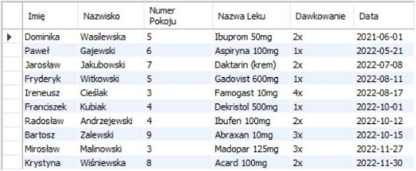
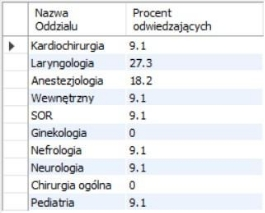



 ## Opis słowny systemu
W ramach projektu zaprojektowana została aplikacja bazodanowa obejmująca infrastrukturę małego szpitala. Pracownicy mają dostęp do kompleksowych informacji odnośnie pacjentów, ich zabiegów tudzież dawkowania leków, stanu magazynu szpitalnego oraz spisu odwiedzin pacjentów.

Baza danych zawiera informacje o:

1. pacjentach, w tym ich dane osobowe jak nazwisko, numer PESEL oraz pokój i oddział w którym są obecnie ulokowani,
    -> dane odnośnie przepisanych leków wraz z ich dawkowaniem zostały rozdzielone do osobnej tabeli. Ułatwia to sytuacje w której pracownik szpitala, np. pielęgniarka, wymaga szybkiego dostępu do leków, które musi danego dnia rozdysponować wśród pacjentów,
1. pracownikach, w tym ich dane osobowe oraz szczegóły wypłaty,
    -> wyróżniona została osobna tabela stanowisk obejmowanych przez konkretnych pracowników, m. in. lekarzy, pielęgniarek, pracowników socjalnych, wraz z ich konkretnymi specjalizacjami,
1. odwiedzinach osób trzecich nie widniejących obecnie w bazie danych, np. rodzina odwiedzająca chorego,
    -> taki katalog jest szczególnie przydatny z perspektywy epidemiologicznej. W wypadku wykrycia łatwo zakaźnej choroby, wszyscy odwiedzający szpital w danym okresie czasu zostaliby odpowiednio poinformowani,
1. zabiegach wykonywanych w szpitalu, w tym zabiegów dla chorych obecnie przebywających w szpitalu, jak i osób trzecich posiadających skierowanie lekarskie,
1. wszystkich oddziałach szpitalnych,
    -> szczegółowe dane nt. sal zabiegowych, chirurgicznych, z łóżkami dla pacjentów etc, dla przejrzystości zostały rozdzielone do osobnej tabeli,
1. zaopatrzeniu, w tym pełen wgląd do magazynów szpitalnych przechowujących niezbędne utensylia oraz leki.

Implementacja tworzona jest z myślą o różnym poziomie dostępu do encji. Preferowanym jest, aby osoba o niskich uprawnieniach nie posiadała wglądu do prywatnych danych osobowych pacjentów, takich jak numer PESEL, oraz aby nie była w stanie tych informacji w żaden sposób modyfikować. Stąd szczególnie przydatny jest rozdział tabel, np. pacjent i dawkowanie leków. Osoba sprawująca role pielęgniarskie będzie w stanie uzyskać dostęp do przepisanych lekarstw, ale nie będzie w stanie podejrzeć newralgicznych danych, jak ww. numer PESEL.

 ## Opis wymagań funkcjonalnych
- aplikacja pozwala na wgląd do zaplanowanych zabiegów,
- sprawdzenie jakie leki powinien przyjąć pacjent danego dnia,
- wyszukanie osób odwiedzających dany oddział,
- sprawdzenie ilości wolnych łóżek na oddziałach i w poszczególnych pokojach,
- zarządzanie zaopatrzeniem,
- przeszukiwanie aktualnego stanu zaopatrzenia szpitala,

 ## Przypadki użycia 

- Sprawdzenie dawkowania leków dla pacjentów - osoba o niższych uprawnieniach, przykładowo pielęgniarka, jest w stanie sprawdzić jakie farmaceutyki, oraz w jakiej ilości, zostały przypisane konkretnym pacjentom. Usprawnia to płynność pracy w szpitalu oraz zdecydowanie minimalizuje prawdopodobieństwo podania nieprawidłowego leku przez pielęgniarkę, która w innym wypadku poinformowana zostałaby o dawkowaniu jedynie werbalnie.

- Sprawdzenie podstawowych informacji o pacjentach - osoba o niższych uprawnieniach, przykładowo pielęgniarka, jest w stanie dowiedzieć się o m.in. ulokowaniu konkretnego pacjenta, wyświetlić nie newralgiczne dane, jak imię czy nazwisko. Jest to zdecydowanie wygodniejsze od ręcznego prowadzenia notatnika z informacjami o pacjentach przez salową.

- Sprawdzenie wykonywanych zabiegów - osoba o wyższych uprawnieniach, przykładowo lekarz, jest w stanie wyświetlić listę zabiegów zaplanowanych w szpitalu, z podziałem na konkretne oddziały i poszczególne w nich pokoje zabiegowe. Umożliwia to dodanie nowego terminu bez ryzyka nałożenia się dwóch zabiegów w jednej sali.

- Sprawdzenie stanu zaopatrzenia - osoba upoważniona jest w stanie przeszukiwać, usuwać i modyfikować rekordy dotyczące stanu magazynu szpitalnego. Radykalnie ułatwia to płynność pracy pracowników, ponieważ jednym poleceniem można przeszukać magazyny wszystkich oddziałów szpitalnych.

- Wyświetlenie odwiedzających szpital - możliwość wyświetlenia wszystkich, wcześniej dodanych, rekordów przechowujących informacje o osobach, które odwiedziły szpital, co do konkretnej godziny i konkretnego oddziału. Możliwość poinformowania wszystkich odwiedzających z danego okresu czasu jest bardzo przydatna w sytuacji np. wydostania się mikroelementu, mogącego narazić system immunologiczny człowieka.
 # Model bazy danych
1. Model logiczny bazy danych:
 
    
  

2. Model fizyczny bazy danych: 

1. Opis ważniejszych transakcji
   1. Tabela *Zabiegi* i *Pacjenci* - podczas dodawania nowego rekordu do tabeli *Zabiegi*, utworzony wcześniej musi zostać nowy rekord w tabeli *Pacjenci*,* który powiązany będzie z rekordem w tabeli *Pokoje*.
   1. Tabela *Dawkowanie* i *Zaopatrzenie* - po rozdysponowaniu leków wg tabeli *Dawkowanie*, przedawnione rekordy zostaną usunięte podczas dodawania kolejnych dawkowań.

1. Opis widoków
   1. Widok *Pielęgniarka* prezentuje przykładowy widok dla pracownika o niższych uprawnieniach. Wyświetla imiona i nazwiska pacjentów oraz numery pokoi, w których zostali oni ulokowani. Widok pozostawia informacje newralgiczne, jak numer PESEL, jako ukryte.
   1. Widok *Dzienne dawki* prezentuje informację o przepisanych lekach przez lekarzy dla pacjentów. Wyświetla imię i nazwisko pacjenta, pokój w którym się znajduje, oraz nazwę i dawkę przepisanego leku.
   1. Widok *Lekarze* prezentuje przykładowy grafik lekarzy. Informuje on o wszystkich zabiegach zaplanowanych w szpitalu. Wyświetla imię i nazwisko lekarza przypisanego do zabiegu, numer pokoju zabiegowego, rodzaj zabiegu, imię i nazwisko pacjenta oraz pokój w którym jest ulokowany.
   1. Widok *Procent odwiedzających* ułatwia prowadzenie statystyk szpitalnych. Wyświetla nazwę oddziału oraz procent ludzi odwiedzających szpital, który odwiedził ten konkretny oddział. Jest to przydatne m.in. w celu określenia przepływu ruchu szpitalnego.
   1. Widok *Wolne łóżka* wyświetla stan wolnych łóżek w poszczególnych oddziałach, sortowany po nazwie oddziałów. Ułatwia kontrolę rozłożenia pacjentów w szpitalu.

1. Opis wyzwalaczy
   1. Wyzwalacz *pacjenci\_BEFORE\_INSERT* zapobiega dodaniu nowego pacjenta do wypełnionego już pokoju, tzn. pokoju, w którym brak jest wolnych łóżek. W przypadku próby wykonania takiej czynności, program wyświetla komunikat błędu “Pokój jest już pełny”, oraz anuluje operacje dodawania.
   1. Wyzwalacz *pacjenci\_AFTER\_INSERT* służy do automatycznej inkrementacji liczby pacjentów przypisanych do pokoju w tablicy *Pokoje*, po dodaniu nowego rekordu do tablicy *Pacjenci*.
   1. Wyzwalacz *pacjenci\_AFTER\_DELETE* służy do zapewnienia spójności w pokojach szpitalnych. Po każdorazowym usunięciu rekordu pacjenta, w pokoju w którym pacjent był ulokowany dekrementowana jest liczba łóżek.
   1. Wyzwalacz *zabiegi\_BEFORE\_INSERT* zapewnia spójność w terminach zabiegów. Przy próbie dodania nowego terminu nakładającego się na termin już istniejący, wyświetlony zostanie komunikat błędu “Podany termin jest niedostępny”, oraz dodanie terminu zostanie anulowane.
   1. Wyzwalacz *dawkowanie\_AFTER\_INSERT* pomaga w utrzymaniu prawidłowego stanu magazynu. W momencie, gdy mija dzień podania pacjentowi przepisanego leku, usunięta zostaje konkretna jego liczba z magazynu.

1. Opis funkcji i procedur
   1. Funkcja *srednia\_oddzialy* oblicza i zwraca średnią ludzi odwiedzających przekazany jako parametr oddział, w porównaniu do wszystkich odwiedzających szpital. Typ zwracanego parametru to FLOAT.
   1. Procedura *ten\_sam\_oddzial* sprawdza i wyświetla wszystkie osoby, które odwiedziły ten sam oddział w tym samym dniu, co nazwisko osoby przekazanej do procedury jako parametr.
   1. Procedura zaplanowane\_zabiegi sprawdza i wyświetla wszystkie zabiegi, na które zapisany został pacjent o nazwisku przekazanym do procedury jako parametr.
#
 # Implementacja bazy danych
   1. Środowisko programistyczne
        Do realizacji projektu wykorzystany zostanie serwer systemu zarządzania bazą danych MySQL oraz narzędzie wspomagające administrację bazą danych MySQL Workbench 8.0.29, oba wymienione rozwiązania dystrybuowane za darmo przez Oracle Corporation.

1. Przykładowe skrypty wykonujące operacje na danych tekstowych
     Wyświetlenie stanu wolnych łóżek w poszczególnych oddziałach, sortowany po oddziałach:

A. Wyświetl informacje o przepisanych lekach dla pacjentów:
 B. Przykładowy skrypt implementujący i wypełniający utworzoną strukturę przykładowymi danymi tekstowymi

C. Przykładowy skrypt implementujący widok

D. Przykładowy skrypt implementujący wyzwalacz

E. Przykładowy skrypt implementujący funkcję1. Tabela *Pacjenci*:

   

 Przedstawienie przykładowych przypadków użycia
   A. Wyświetlone zostały informacje odnośnie przepisanych leków dla konkretnych pacjentów szpitala. Wszystko za pomocą widoku *Dzienne dawki*. Zdecydowanie zwiększa to płynność pracy pracowników szpitalnych.

B. Wyświetlony został procent osób odwiedzających dane oddziały w szpitalu. Zarząd szpitala jest w stanie w łatwy i szybki sposób uzyskać informację na temat obłożenia szpitala, przykładowo w celu zwiększenia jego przepustowości. Wszystko za pomocą widoku *Procent odwiedzających*.

 Wnioski
1. Projekt umożliwił nam dokładne spojrzenie na proces kreowania bazy danych. Pomógł nam dostrzec podstawowe wymagania dla nawet najprostszych implementacji baz danych oraz podstawowe założenia działania systemów zarządzania bazą danych (ang. *database management system*).

1. Znacznie udoskonalił nasze umiejętności posługiwania się językiem SQL, oraz poruszania się po bazie danych. Zwrócił uwagę na szczegóły implementacyjne, które automatyzują pozornie monotonne polecenia SQL przy użyciu funkcji, widoków oraz wyzwalaczy.

1. W celu implementacji bazy danych po raz pierwszy posługiwaliśmy się programem do zarządzania bazą danych, MySQL Workbench, oraz pierwszy raz uruchomiliśmy i konfigurowaliśmy serwer SQL do własnych potrzeb. Jest to wiedza zdecydowanie przydatna, system zarządzania bazą danych nie jest programem szczególnie przejrzystym oraz prostym do zrozumienia, stąd zdobycie tej wiedzy na tak wczesnym etapie może być bardzo przydatne w przyszłości.

1. Dowiedzieliśmy się o możliwościach, jak i ograniczeniach, współczesnych baz danych, oraz zdobyliśmy perspektywę na ich złożoność.

